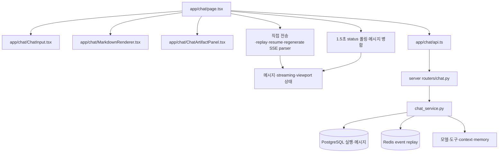

# 현재 채팅 코드 감사 및 기존 보고서 대조

버전 1.0 · 기준일 2026-09-12 · 작성 목적: PRD·설계의 실제 코드 근거.

## 1. 조사 범위와 판정 방식

`/chat`의 실제 import 경로, viewport/메시지 병합/SSE/폴링/입력/Markdown/artifact/인증/버전 갱신, 연결된 FastAPI 조회·제어·복구·interrupt·context 경로, 테스트·배포 설정을 검토했다. 모든 도구·모델 provider의 구현을 전수 실행하거나 운영 보안 침투 테스트를 수행한 것은 아니다. 표의 **확인**은 코드상 사실, **위험**은 그 구조에서 가능한 실패 경로, **미측정**은 추가 fixture·운영 계측이 필요한 항목이다.

우선순위 P0는 다음 개선 작업의 선행 조건을 뜻한다. 모든 P0 항목이 현재 운영에서 발생 중인 사고라는 뜻은 아니다. 단순 줄 수는 실행 시간·성능 측정값이 아니다.

### 기준 snapshot

| 저장소 | 조사 기준 HEAD | 상태 |
|---|---|---|
| Dashboard | `7888271939685b093c0572e935e7f7a3a384be6e` | 직전 기능 수정 `0ed523f43a28`, 문서 완료 기록 포함 |
| Server | `e50f0ef9f9a397fcb0908fdcd6cb477723a1c2c0` | `98e6715d`, `e33eb5eb` fencing 재시도 회계 수정 포함 |

최종 재확인: Server HEAD `683cfb0d7840463ef38c1d236e229a91a7021c72`의 추가 변경은 금융 API·서비스·문서·테스트와 HANDOVER 7개 파일이다. `chat_service.py`, `routers/chat.py`, `interrupt_queue.py`, `stream_worker.py`의 SHA-256은 아래 조사 지문과 동일하다. 다른 작업자의 신규 커밋을 되돌리거나 이번 문서 변경으로 취급하지 않는다.

조사 시작 시 기존 미커밋 변경:

- Dashboard: `src/app/admin/model-routing/page.tsx`, `src/components/chat/ChatInput.tsx`, `src/lib/navigation.ts`.
- Server: `app/api/llm_models.py`, runtime `app/data/yeoljeong_finance/delivery_browser_session_events.jsonl`, untracked `app/scripts/`.
- 해당 변경은 본 문서 작성에서 수정하거나 릴리스 대상으로 포함하지 않는다. runtime event 파일의 내용은 근거 자료에 복사하지 않았다.

### 주요 파일 지문

| 파일 | SHA-256 |
|---|---|
| dashboard `src/app/chat/page.tsx` | `f39bec087c1cb2e50eb86af918e200f0d8d3b3ab05616e0b6f21f44b73269f6c` |
| dashboard `src/app/chat/ChatInput.tsx` | `0320fc4c9fb95e61f1a40eac20e078b2e0621b35e5ef6b1ec445bbc45cb4e04a` |
| dashboard `src/app/chat/api.ts` | `33ba775c4ca37bf325ad9e875df21a5bf9481f4dd4bfa655830ec1bfec6d279d` |
| dashboard `src/app/chat/MarkdownRenderer.tsx` | `7b4209b87f288ecc2f11bbf297055dc12a5351f77932d4b31aada811b56edd79` |
| dashboard `src/app/chat/ChatArtifactPanel.tsx` | `55486cb034ae35cf5a927d3063e73dd2cf52357cf307b75675983d14948cd1de` |
| server `app/services/chat_service.py` | `7c79e17e020372071d43fca4926bb9979c5dd695ff22839b6ae7e000b5d37a8f` |
| server `app/routers/chat.py` | `d176f540afaa3c664e837eac13ada58e354d4b0363c06a2f10fc58e2dba80d78` |
| server `app/core/interrupt_queue.py` | `3e2062e6ce25cb7246022cc5fffafd580dde31f9811d2812b19c3c74d50b6de6` |
| server `app/services/stream_worker.py` | `4e504cbf3ba296288c210083cbbe15d6437fb880586bec7fdbde49cf6e2fb957` |

## 2. 실제 실행 구조



`src/components/chat/ChatInput.tsx`와 `src/hooks/useChatSSE.ts`가 존재하지만, 메인 `/chat`은 전자의 입력창을 import하지 않으며 후자의 hook을 실행하지 않는다. 실제 입력창에는 IME 방어가 있다. 이름이 같은 보조 파일의 상태를 메인 제품의 상태로 일반화하지 않는다.

| 측정 대상 | 코드량/검색 결과 |
|---|---:|
| page.tsx | 12,708줄 / 603,689 bytes |
| 실제 ChatInput.tsx | 586줄 / 23,687 bytes |
| 실제 ChatArtifactPanel.tsx | 2,710줄 / 122,896 bytes |
| MarkdownRenderer.tsx | 599줄 |
| chat_service.py | 14,606줄 / 683,068 bytes |
| routers/chat.py | 3,897줄 / 166,745 bytes |
| main.py | 3,542줄 |
| page effect 호출 문자열 | 67개 |
| page `setStreaming(true/false)` | 48개 |
| page `setMessagesPreservingViewport(` | 83개 |
| page `setInterval(` | 7개 |
| page 직접 `container.scrollTop =` | 5개 + 별도 `scrollIntoView` |

호출 수는 `rg` 정적 검색 기준이다. 동시에 활성화되는 timer 수나 실제 렌더 횟수와 다르다.

## 3. 상세 발견 사항

### C01 — runtime·compiler·build gate 불일치 · P0

근거: [package.json](../../package.json), [next.config.ts](../../next.config.ts) 5행, [Dockerfile](../../Dockerfile) 1/13행.

설치 확인: Node `20.20.2`, TypeScript `5.9.3`, Next `16.3.4`, React `19.2.3`, compiler `19.0.0-beta-ebf51a3-20250411`. manifest compiler 범위는 `^19.0.0-beta-e993439-20250328`다. `ignoreBuildErrors:true`, `next build --webpack`, compiler 기본 on이다. Node 20은 확인일 현재 EOL이다([W09](SOURCES.md)). 타입 검사를 별도로 통과했더라도 배포 build가 타입 오류를 차단하는 계약은 아니다. Node 24 LTS·안정 compiler·필수 typecheck를 묶어 정비한다.

### C02 — 페이지와 서비스에 책임 과밀 · P1

근거: [page.tsx](../../src/app/chat/page.tsx), [chat_service.py](../../../aads-server/app/services/chat_service.py). 상태·API·모델 선택·문서 UI·복구가 한 곳에 모인다. 5월 보고서의 page 6,347줄에서 현재 12,708줄로 증가했다. 줄 수 감소 자체보다 state 소유자·모듈 경계·테스트 가능한 순수 reducer가 목표다.

### C03 — viewport writer 분산 · P0

근거: page 3887 `scrollToMessagesBottom`, 3936 부근 anchor 적용, 4046 예상 밖 reset, 6116 MutationObserver, 6171 초기 scroll, 6220 streaming interval, 2470 답글 이동. v1에서 긴 복원 반복을 줄였으나 초기 진입·하단 추적·상단 방어·명시적 이동은 아직 독립한다. viewport controller와 adapter에 명령을 모아 사용자 gesture와 경쟁을 차단한다.

### C04 — 상태 updater 내부 부작용 · P0

근거: page 4000~4012 `setMessagesPreservingViewport`; updater 내부 `restoreMessageViewportAnchor(anchor)`는 ref와 RAF를 변경한다. React 순수 updater 계약과 맞지 않는다([W03](SOURCES.md)). no-op skip은 이미 있으므로 유지한다. message transaction에 viewport intent를 함께 기록하고 commit effect에서만 실제 DOM 쓰기를 실행한다.

### C05 — 액션 높이 안정화는 완료, 전역 갱신 비용 잔존 · P1

근거: page 3286/3400 actions visibility, 3496 memo comparator, 11187 `historyActionsLocked`. 현재 숨김도 공간을 보존해 직접 높이 진동을 막는다. lock 변경은 과거 row에도 전달되고 user action 공간 약 30px를 유지한다. action chrome 구독을 별도로 분리한다. 답글/수정/삭제/재생성/이어쓰기의 실행 중 허용 범위도 각 버튼 임의 조건 대신 capability로 명세한다.

### C06 — 늦은 이미지·폰트 높이 변화 보호 부족 · P1

근거: page 10964 `overflowAnchor:none`, 3972 복원은 commit+RAF, Markdown renderer image 경로. 현재 커스텀 정책에 브라우저 anchoring이 자동 보완해 준다고 설명하면 부정확하다([W28](SOURCES.md)). 크기 예약·실제 layout delta 보정이 필요하며 수초간 과거 anchor를 반복 재적용하면 안 된다.

### C07 — execution·transport·view 상태 결합 · P0

근거: page 3605 `streaming`, 4426 `waitingBgResponse`, 48개 setter, `StreamingStatusPayload` 64행. network 종료와 final DB 저장·복구 단계가 분산되어 있다. 세션/실행 ID에 연결된 명시적 상태 기계와 terminal guard로 전환한다. 서버가 내려준 본문 내용으로 완료 여부를 추론하던 경로는 `c6f8601`에서 이미 수정한 이력이 있다.

### C08 — async interval의 겹침·늦은 응답 위험 · P0

근거: page 6311~6780, `setInterval(async () => …,1500)`, cancelled flag, 여러 await와 50건 재조회. cancelled 보호는 존재하지만 동일 세션에서 느린 tick 두 개의 순서 역전을 방지하는 단일 in-flight/response generation 계약은 없다. `bgPartialContent`도 effect 의존성에 포함된다. single-flight scheduler·request epoch·revision 순서 검증이 필요하다. 운영에서 순서 역전을 이번에 재현한 것은 아니다.

### C09 — 서버 광고 cursor와 클라이언트 적용 cursor 혼합 · P0

근거: page 6347 `lastEventIdRef.current = ss.last_event_id`, 4892/7502 parser의 id 줄 처리. 서버 최신 ID를 아직 적용하지 않은 delta의 소비 ID로 사용하면 reconnect에서 건너뛸 가능성이 있다. `serverHighWatermark`, `lastAppliedEventId`, snapshot의 `coversThroughEventId`를 분리하고 payload 적용 성공 뒤에만 소비 cursor를 진전시킨다.

### C10 — SSE parsing/dispatch 중복 · P0

근거: page 4873 replay, 7444 send, 8132 resume, 8827 regenerate; 줄 단위 `data: ` JSON 처리. 현재 서버 형식에서는 동작하지만 CRLF·multi-data·부분 UTF-8·blank-line dispatch 등 표준 전체를 한 곳에서 보장하지 않는다([W14](SOURCES.md)). event 신규 추가 시 네 경로가 달라질 수 있다. 공통 parser와 reducer를 사용한다. `src/lib/sse.ts`는 별도 project stream이며 현재 chat parser 대체품이 아니다.

### C11 — 메시지 정체성·본문 길이 추정 의존 · P0

근거: page 1501 finalization match, 1667 local/server match, 1708 merge, 9698 display grouping. `render_id`/execution 보호는 이미 있으나 prefix·길이·intent 조합 fallback이 남는다. preview가 full을 덮지 않는 보호와 정상 편집으로 본문이 짧아질 권리를 동시에 보장해야 한다. 명시적 message version·content completeness·generation/segment ID가 필요하다.

### C12 — 렌더 cap과 과거 조회 UX 불일치 가능 · P1

근거: page 9698 `displayData`, `renderSourceLimit=120/220`, `MAX_RENDER=150/200`, protected user 보존, 11179 표시 문구. 단순히 “항상 150개 이하 DOM”이라고 설명할 수 없다. 이전 페이지를 fetch해도 다시 최신 slice에서 제외될 위험을 fixture로 확인해야 한다. virtualization+양방향 page cache로 읽고 있는 구간을 보존한다.

### C13 — 목록 경량 projection은 이미 구현 · 보존/P1

근거: [router](../../../aads-server/app/routers/chat.py) 1157 fields, [service](../../../aads-server/app/services/chat_service.py) 8506 `_message_select_fields`, 8970/9018 목록; page 6681 minimal 5건, 5746/6001 초기 120건. `minimal/full/render`와 tool summary/detail 기반을 재사용한다. full 본문이 필요한 화면에서 무조건 minimal 40건으로 바꾸면 preview→full 높이 변화를 다시 유발한다.

### C14 — revision은 존재하지만 단조 증가 counter가 아님 · P1

근거: router 102 `_encode_revision`, 109 `_get_streaming_status_revisions`: count+max(created_at,edited_at), artifact aggregate. 수정 시 edited_at 누락·동일 timestamp·여러 변경 조합에 대한 완전한 변경 원장은 아니다. 매 조회 aggregate 비용도 있다. 먼저 기존 token은 opaque equality로만 사용하고, 모든 가시 mutation과 동일 transaction의 monotonic revision/outbox로 이행한다. 과거 token을 숫자 크기나 사전순으로 비교하지 않는다.

### C15 — timestamp-only cursor 경계 누락 위험 · P1

근거: service 9018 `list_messages_cursor`, `created_at < $2`, `ORDER BY created_at`, `messages[0].created_at` cursor. 동일 시각 메시지가 페이지 경계에 있으면 빠질 수 있다. tenant/session scope의 `(created_at,id)` keyset과 opaque cursor로 바꾸고 원본 조회 경계와 화면 dedupe 경계를 분리한다.

### C16 — 조회 API가 DB 상태를 고침 · P0

근거: router 1743 pipeline terminal review의 `UPDATE chat_turn_executions`·message 변경; service 8970/9018 full/render 목록의 `_repair_completed_execution_message_flags`·`_promote_inactive_streaming_placeholders` 호출. 최소 projection은 조기 return하는 경로가 있지만 full/render는 순수 조회가 아니다. 특히 해당 router terminal UPDATE에는 owner epoch 조건이 보이지 않는다. 조회를 read-only projection으로 바꾸고 복구 writer는 DB-fenced command/worker로 옮긴다. 이미 존재하는 복구 기능을 단순 삭제하면 stale 버블이 남으므로 writer 이관이 선행돼야 한다.

### C17 — 추가 지시의 DB 보관과 처리 완료 사이 공백 · P0

근거: router 2622 `interrupt_session`, 2725 DB INSERT 실패를 log한 뒤 메모리 push·`queued:true`; service 1939 `_fetch_persisted_interrupts`가 SELECT 후 실행 전 `interrupt_applied`로 UPDATE; 2022 `_collect_queued_interrupts`. 메모리만 사용하는 구조는 아니다. 다만 durable 접수 ACK·execution binding·claim lease·처리 완료 ACK가 분리되지 않아 재시작/동시 worker에 취약할 수 있다. content 기반 중복 판정 대신 command ID로 처리한다.

### C18 — owner fencing·retry 보정은 재사용 대상 · 보존/P0 검증

근거: service 181 claim, 226 heartbeat, 1118 actual model attempt, 4118 terminal guard, 7012 resume, 7694 fenced exit; commits `98e6715d`, `e33eb5eb`. fencing 시 이미 청구된 retry를 상한 내 환급하는 후속 수정도 있다. 전면 재작성하지 않고 writer inventory·queue/model/tool wait·late callback contract로 검증한다. 횟수 정책 변경 시 모델 비용/attempt ledger와 retry budget을 구분해야 한다.

### C19 — Redis replay의 한계와 snapshot 연결 필요 · P0

근거: [stream_worker.py](../../../aads-server/app/services/stream_worker.py) `deliver_sse`: missing stream은 `resume_unavailable`, 완료는 `resume_done`, timeout 별도 이벤트. 이 구분은 보존한다. reconnect 정합성은 event ID와 동일 시점 content snapshot의 결합을 추가해야 한다. Redis 보관 실패를 모델 재실행 사유로 바로 바꾸면 비용과 side effect가 중복될 수 있다.

### C20 — LLM context는 별도 DB 원본 경로 · 보존

근거: service 11440/11458 `LIMIT 200`, 11479 `build_messages_context`; 분기·resume 경로에도 독립 조회 존재. UI 40건·가상화 범위는 LLM context 제한과 무관하게 설계한다. memory/RAG·embedding·thinking/tool 원본·비용 저장을 축소하지 않는다. “memory는 chat_messages와 전혀 의존이 없다”는 과거 일반화 대신 실제 경로 보존 테스트를 요구한다.

### C21 — API helper·수기 type 중복 · P1

근거: 실제 [app/chat/api.ts](../../src/app/chat/api.ts), [app/chat/types.ts](../../src/app/chat/types.ts), 별도 [services/chatApi.ts](../../src/services/chatApi.ts), [lib/auth.ts](../../src/lib/auth.ts). BASE_URL·401·cookie fallback·ChatMessage 정의가 다르며 응답은 `as Promise<T>`다. 실제 transport 한 개, generated schema, UI view model adapter로 분리한다. TS generic만으로 runtime 응답이 검증되는 것은 아니다.

### C22 — 입력·음성·첨부의 보존 요구 · P1

근거: 실제 ChatInput 57 localInput, 74 composingRef, 200 부근 음성 요청·MediaRecorder; page 9257 IME guard, 8989 업로드·FileReader. 입력은 이미 자식 state이고 IME 방어·비동기 FileReader가 있다. 보조 components 입력창의 `@ts-nocheck`/IME 부재를 메인 결함으로 보고하지 않는다. 세션별 draft·음성 요청 generation·업로드 중 이동·mic track cleanup·제출 ACK 전 draft 보존은 새 계약으로 명세한다.

### C23 — 인증정보 JS 접근·deep link 손실 위험 · P0/P1

근거: 실제 api 6 getToken의 localStorage/JS cookie 동기화, 32 handleChat401의 `pathname+search`(hash 없음), lib/auth 91 cookie·121 로그인. XSS가 발생할 때 토큰 접근 면적이 크다. 현재 `/chat#session` 복귀도 인증 redirect에서 누락될 수 있다. HttpOnly 전환은 앱 전체 영향도를 검증하며 CSRF·PC agent callback·SSE auth를 같이 다룬다. 취약점 악용을 이번에 실행한 것은 아니다.

### C24 — HTML 새 창 경로의 sandbox 소실 · P0

근거: 실제 [ChatArtifactPanel.tsx](../../src/app/chat/ChatArtifactPanel.tsx) 2257 `window.open` 뒤 `document.write(activeArtifact.content)`, 2282 iframe은 `sandbox=allow-scripts`. 패널 iframe 격리가 새 창에도 유지된다고 볼 수 없다. 보조 ArtifactHtmlPreview 33 Blob 새 창도 별도 점검 대상이다. 신뢰하지 않는 생성 HTML을 앱 origin의 실행 문서로 열지 않도록 별도 preview origin·CSP·noopener 정책을 먼저 설계한다. exploit 실증은 별도 test origin에서 수행한다.

### C25 — Markdown sanitization 정책 명시 부족 · P0

근거: [MarkdownRenderer.tsx](../../src/app/chat/MarkdownRenderer.tsx) 44 plugin list는 rehypeRaw+highlight, 49 tag denylist, 560/589 disallowedElements. URL 보호·위험 tag 차단은 이미 있다. 이것을 모든 HTML 속성·DOM clobbering·SVG까지 검사하는 allowlist sanitizer와 동일시하지 않는다([W22/W23](SOURCES.md)). 링크·차트·코드 class 기능을 살린 schema와 악성 fixture를 만든다.

### C26 — artifact eager load와 늦은 세션 응답 · P1

근거: page 52 상한60, 5926 세션 진입 fetch, then에서 `setArtifacts`(동일 분기의 cancelled 검사 없음), 7643 완료 refresh. workspace 전체 조회는 이미 session 범위로 개선됐지만 패널 숨김에도 로드한다. A→B 빠른 전환에서 A 응답이 늦게 도착하는 fixture, scoped cache+abort·revision 기반 갱신이 필요하다.

### C27 — 버전 갱신 viewport 보존은 완료, draft 계약은 별도 · P1

근거: [useVersionCheck.ts](../../src/hooks/useVersionCheck.ts) 31~40 refresh 이벤트, page 4015/4032/6163 anchor 저장·복원. 일반 입력 draft는 실제 ChatInput의 local state이며 일부 query prefill sessionStorage 경로와 다르다. 배포 갱신·로그인 복귀·세션 이동 시 draft/선택 모델/첨부 업로드 참조를 scope에 맞게 복원해야 한다.

### C28 — 기존 기능군을 분리 과정에서 보존해야 함 · P1

근거: page imports·6912 image·7070 send·8704 edit·8743 delete·8771 regenerate·9361 문서 링크; router bookmarks/search/branch/diff/artifacts/files/research/memory/todos/export/templates/discussion. 상세 기능 보존 표는 [PRD](PRD.md)에 있다. 유지보수 개선이 특정 메시지 intent·CEO 질문·runner 결과를 다시 숨기는 계기가 되어서는 안 된다.

### C29 — 테스트 실행기·품질 gate 부족 · P0

근거: package scripts는 dev/build/start/lint만 존재, 두 selftest 파일; eslint config purity/refs 등을 warning으로 설정; dashboard `.github/workflows`에는 health monitor 확인. 기존 selftest는 버리지 않고 CI 명령으로 승격한다. 문자열 기반 static 테스트만으로 스크롤/경합 동작이 보장되지 않는다. hook 경고를 단순 dependency 추가로 해결하면 poll 재생성 루프가 생길 수 있어 상태 분리와 함께 수정한다.

### C30 — backend test·환경 재현성 · P1

근거: [pyproject.toml](../../../aads-server/pyproject.toml) Python>=3.11, dev pytest 목록; [CI](../../../aads-server/.github/workflows/ci.yml) Python3.12, `--timeout` 사용, optional E2E continue-on-error; [run_py311_tests.sh](../../../aads-server/scripts/run_py311_tests.sh) 별도 3.11 실행기. pytest-timeout의 명시적 dev dependency는 현재 목록에서 확인되지 않았다. clean test image에서 plugin·DB·Redis fixture를 고정해야 한다. 이전 호스트 실행은 asyncpg 부재로 collection 실패했고 운영 image에는 pytest 실행기가 없었으므로 backend suite 통과로 보고하지 않는다.

### C31 — local UI 상태·알림의 scope 및 수명 · P1

근거: page 54~57 completion ACK storage, 5594/5665 workspace-session 저장, 4144 query prefill; voice/push imports. draft·ACK·read cursor·메모리 cache는 tenant/user/session/execution 범위를 정의하고 logout·tenant 전환·TTL에 정리한다. OS 알림·음성은 명시 동의와 중복 방지, secret redaction이 필요하다. 저장된 bearer 값은 조사하지 않았다.

### C32 — 배포·대형 asset·문서 운영 · P1/P2

근거: [deploy.sh](../../deploy.sh) 116 clean archive build, 277 no-build, 371 monitor, [R08](SOURCES.md) clean context 약452MiB 기록. 현재 배포 규칙의 단일 image·drain·same digest는 유지한다. asset 부피는 이전 릴리스 측정이며 이번 재빌드 값이 아니다. 고해상도 print assets 분리, 문서/코드/테스트 traceability와 만료된 hotfix 제거를 관리 과제로 둔다.

## 4. 이전 보고서의 반영·정정

| 이전 주장/계획 | 현재 판단과 이번 설계 |
|---|---|
| revision/fields가 없다 | 현재 이미 존재. 모든 경로 소비·변경 원장 정합성을 개선 |
| interrupt는 메모리뿐 | DB queued message 저장·recovery 존재. receipt/claim/apply ACK 공백을 보완 |
| 초기 40 minimal이면 안전 | full 필요·tool metadata·preview downgrade·높이 변화를 함께 보장해야 안전 |
| ref+useSyncExternalStore면 React 렌더 우회 | 구독 범위를 줄이는 방식이며 React render는 유지 |
| Markdown 마지막 N줄만 파싱 | 표·목록·fence·reference link 문법 경계를 깨뜨릴 수 있어 안전한 block renderer 검증으로 대체 |
| 첫 모델 토큰 200ms | provider/network 의존. 입력 echo/로컬 commit과 provider TTFT를 분리 측정 |
| manual이면 모든 프로그램 쓰기 0 | 능동 gesture 중 0, 자동 추적 0. prepend·앞쪽 이미지 크기 변경은 같은 읽기 anchor를 지키는 한정 보정 허용 |
| 늦은 이미지는 브라우저 anchor가 처리 | 현재 overflow-anchor:none이므로 자동 보완 불가 |
| 상용 Message List scrollModifier를 react-virtuoso에 사용 | 패키지·라이선스 구분. 기본안 MIT core adapter |
| 기존 5일/8~12일 일정으로 전체 개선 | 당시 일부 FE 범위 추정. 보안·API·durable 기능이 추가된 전체 일정은 새 WBS로 재산정 |
| direct compose 재시작으로 배포 | 최신 [전역 AGENTS](../../../AGENTS.md)의 Blue/Green 규칙이 우선 |

## 5. 이번 검증과 남은 확인

- 기존 scroll policy 12개 case를 설치된 TypeScript transpiler와 Node VM으로 메모리에서 실행: **12개 통과**. 파일 출력·패키지 설치 없이 실행했다. DOM·브라우저 E2E와 동등하지 않다.
- 현재 소스의 `npx tsc --noEmit --incremental false --pretty false` 결과는 [검증 계획의 작성 검증 기록](VERIFICATION-AND-ROLLOUT.md#작성-검증-기록)에 기록한다.
- 이번에 운영 대화 전송, 실행 재개, DB repair API 호출, 악성 HTML 실행, 앱 배포는 수행하지 않았다. R08의 실제 세션 검증 결과는 과거 evidence로만 유지한다.
- backend full regression, 재현 fixture, 실제 모바일 IME·VoiceOver, 활성 polling의 latency·INP·heap, 모든 object endpoint tenant 검사·HTML exploit 경로는 구현 단계 검증 대상이다.

## 6. 재현용 읽기 전용 조사 명령

```bash
git rev-parse HEAD
git status --short
wc -l -c src/app/chat/page.tsx
rg -n 'setStreaming\((true|false)\)|setMessagesPreservingViewport\(' src/app/chat/page.tsx
rg -n 'scrollTop\s*=|scrollIntoView|MutationObserver|ResizeObserver' src/app/chat/page.tsx
rg -n 'limit=120|limit=50|fields=minimal|message_revision' src/app/chat/page.tsx
rg -n 'ignoreBuildErrors|reactCompiler' next.config.ts
```

새 HEAD에서 행 번호가 달라지면 위 symbol 검색과 source SHA로 재확인한다. 과거 행 번호만 맞춘 임시 patch script를 실행하지 않는다.
