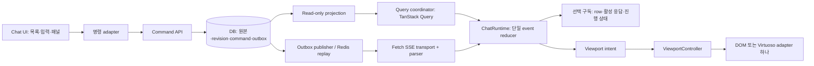
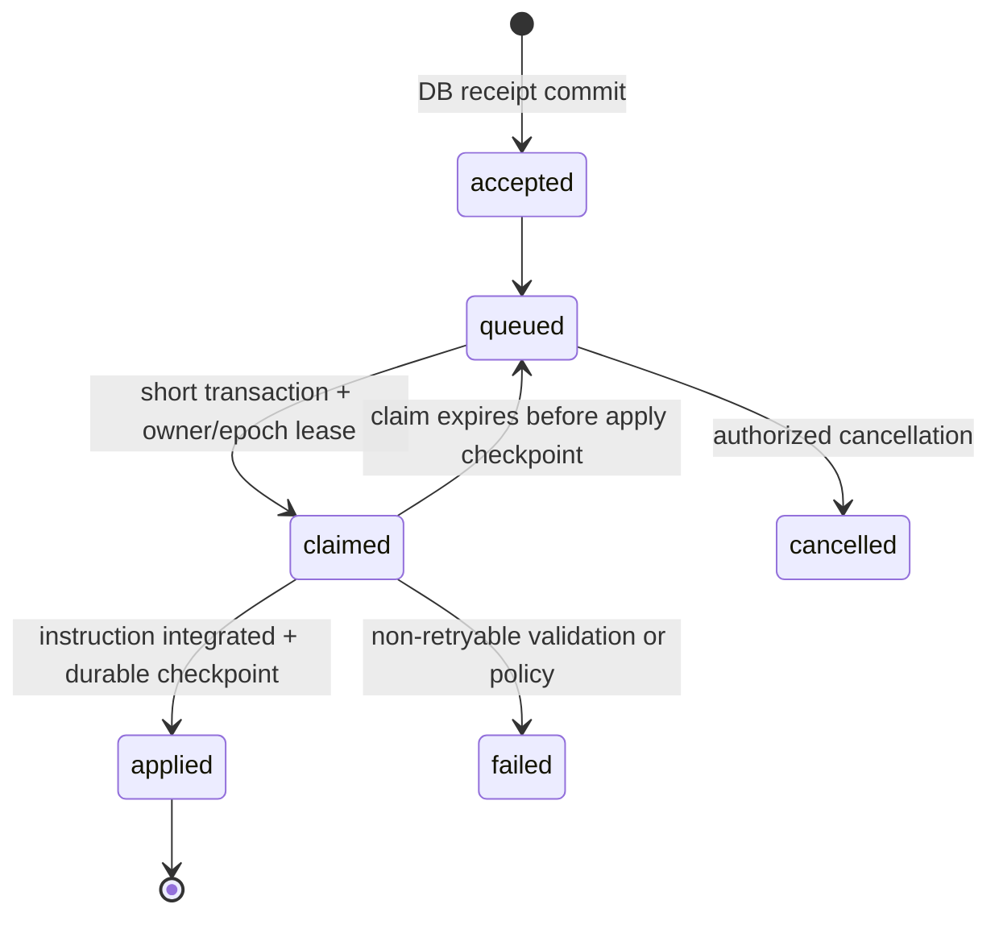

# AADS 채팅 구조 개선 상세 기술 설계

버전 1.0 · 2026-09-12 · 상태: 구현 전 설계안. 현재 구현과 구분되는 신규 타입·경로·DDL은 **제안 계약**이다.

연결 문서: [PRD](PRD.md), [코드 감사](CURRENT-CODE-AUDIT.md), [검증·WBS](VERIFICATION-AND-ROLLOUT.md), [출처](SOURCES.md).

## 1. 설계 불변식

| ID | 불변식 | 담당 경계 |
|---|---|---|
| INV01 | 사용자의 능동 gesture와 경쟁하는 자동 scroll은 없다 | ViewportController |
| INV02 | 프로그램 viewport 변경은 하나의 adapter를 통하며 reason·sessionEpoch·gestureEpoch가 있다 | ViewportAdapter |
| INV03 | 메시지 의미의 source of truth는 DB, 브라우저 projection은 단일 reducer가 갱신 | MessageRepository/ChatRuntime |
| INV04 | transport 종료와 execution 종료는 다른 사건이다 | StreamTransport/ExecutionReducer |
| INV05 | 동일 event·command의 재전달은 사용자 결과를 중복시키지 않는다 | EventReducer/CommandService |
| INV06 | 적용하지 않은 event를 적용 cursor로 기록하지 않는다 | EventReducer/SnapshotContract |
| INV07 | terminal 실행은 stale callback으로 바뀌지 않으며 mutable writer는 lease·epoch를 검증한다 | ExecutionRepository |
| INV08 | 조회는 가시 상태·본문·실행을 수정하지 않는다 | QueryService/read-only DB transaction |
| INV09 | preview는 full 본문을 대체하지 않되 최신 명시적 편집은 짧아져도 반영한다 | MessageVersionPolicy |
| INV10 | UI fetch/가상화는 LLM context·원본 저장 정책을 변경하지 않는다 | ChatReadModel/ContextReader |
| INV11 | 조직·사용자·세션 경계 밖의 cache/event/파일은 반영하지 않는다 | TenantScope/AuthAdapter |
| INV12 | raw HTML이 앱 origin의 credential에 접근하는 실행 문서가 되지 않는다 | PreviewService/Renderer |
| INV13 | receipt는 durable commit, applied는 실제 실행 반영 checkpoint를 뜻한다 | CommandLedger |
| INV14 | side effect의 실행 여부가 모호하면 무조건 재실행하지 않고 reconcile한다 | ExecutionStep |
| INV15 | protocol·DB 변경은 한 버전 전 FE/BE와의 호환과 rollback 증거를 갖는다 | ReleaseContract |

## 2. 목표 구조 및 상태 소유권



### 2.1 저장소별 책임

| 상태 | 소유자 | React 구독/수명 |
|---|---|---|
| canonical browser message entities·order·versions | ChatRuntime reducer | message/segment ID 선택 구독, 세션 LRU |
| active delta·tool events·last applied cursor | ChatRuntime의 execution slice | 활성 bubble만 subscribe |
| HTTP request·in-flight dedupe·page cursor 목록·fetch error | TanStack Query coordinator | query cache에는 page ID/immutable response snapshot만; 별도 mutable messages 배열 금지 |
| executionPhase·accepted command status | execution slice, DB projection 기준 | status bar·capability selector |
| transport state·retry timer·reader | StreamTransport 한 개 | effect lifecycle; UI mode와 독립 |
| followMode·gesture epoch·anchor·pending viewport intent | ViewportController | 목록 영역 구독, session scope |
| draft·selection·uploads·voice | ComposerStore | 해당 입력창만 구독; 탭 session 보관 |
| artifact list/meta/detail | scoped query coordinator | 패널/명시적 링크 요청 때 hydrate |
| 인증·tenant scope | AuthAdapter | logout/tenant 전환 시 runtime·query·draft 일괄 폐기 |

TanStack Query와 ChatRuntime에 서로 독립적인 canonical 메시지를 두지 않는다. queryFn의 모든 응답은 scope/version 검사를 거쳐 reducer에 합류한다. React에는 안정된 immutable snapshot을 제공한다. `getSnapshot()`에서 매번 새 객체를 만들거나 같은 객체를 직접 mutate하지 않는다([W05](SOURCES.md)).

### 2.2 디렉터리 제안

```text
src/app/chat/page.tsx                 # route shell, composition만
src/features/chat/
  domain/
    chatTypes.ts                     # 내부 view model; API type과 분리
    messageReducer.ts
    executionReducer.ts
    viewportPolicy.ts
    capabilities.ts
  runtime/
    createChatRuntime.ts
    sessionScope.ts
    selectors.ts
  transport/
    sseParser.ts
    chatTransport.ts
    legacyEventAdapter.ts
    snapshotAdapter.ts
  queries/
    chatQueryKeys.ts
    chatQueryCoordinator.ts
  viewport/
    useChatViewportController.ts
    domViewportAdapter.ts
    virtuosoViewportAdapter.ts
  components/
    ChatPageShell.tsx
    ChatTimeline.tsx
    MessageRow.tsx
    ActiveResponse.tsx
    MessageActions.tsx
    ChatComposer.tsx
    ExecutionStatus.tsx
    ChatArtifactPanel.tsx
  composer/
    draftStore.ts
    uploadQueue.ts
    voiceController.ts
  rendering/
    MarkdownContent.tsx
    StreamingMarkdown.tsx
    ToolEventList.tsx
    htmlPolicy.ts
  observability/
    chatTelemetry.ts
    diagnosticSnapshot.ts
  testing/
    fixtures/
    eventSequences/
src/generated/chat/                  # Pydantic/OpenAPI로 생성; 수기 수정 금지
```

기존 실제 `app/chat/ChatInput`, `MarkdownRenderer`, `ChatSidebar`, `ChatArtifactPanel`을 adapter로 감싸서 이관한다. `components/chat`의 동명 컴포넌트나 `useChatSSE`를 확인 없이 재사용/삭제하지 않는다. import 사용처·storybook/test·다른 route를 확인하고 마지막 consumer가 사라진 뒤 제거한다. 목표 page shell은 대략 500줄 이하, 신규 관심사 모듈 500줄 이내를 권장하되 의미 없는 파일 쪼개기로 통과하지 않는다.

### 2.3 서버 모듈 경계 제안

```text
app/chat/
  contracts/                         # requests/responses/event envelope
  queries/                           # view, messages, artifacts; read-only
  commands/                          # send, interrupt, stop, resume, edit
  executions/                        # owner, lease, terminal, step lifecycle
  repositories/                      # tenant-scoped SQL/transactions
  streaming/                         # replay, snapshot, publisher
  projections/                       # message visibility, full/render/minimal
  observability/
```

첫 이관에서 HTTP 경로를 바꾸거나 14,606줄 전체를 한 번에 옮기지 않는다. 기존 chat_service wrapper가 새 service를 호출하는 방식으로 조회·interrupt·fencing부터 추출한다. model_selector/context_builder는 기존 adapter로 연결한다.

## 3. 실행·연결·표시 상태 기계

### 3.1 타입 계약

```ts
type ExecutionPhase =
  | 'idle' | 'queued' | 'running' | 'recovering' | 'finalizing'
  | 'awaiting_approval' | 'stopping' | 'completed' | 'interrupted' | 'failed';
type TransportState = 'disconnected' | 'connecting' | 'connected' | 'reconnecting' | 'offline';
type FollowMode = 'auto' | 'manual';
type Scope = { tenantId: string; userId: string; sessionId: string; sessionEpoch: number };
type CommandStatus = 'pending_local' | 'accepted' | 'queued' | 'claimed' | 'applied' | 'failed' | 'cancelled';
```

기존 서버 status `running/retrying`와 `stream_status`를 legacy adapter로 매핑한다. `needs_continuation`을 자동으로 completed 또는 failed로 강제하지 않고 사용자 재개 가능 상태와 중단 이유를 보존한다. terminal 여부는 서버 실행 원장과 final message readiness를 함께 확인한다.

| 사건 | execution 변화 | transport 변화 | viewport 변화 |
|---|---|---|---|
| durable send accepted | queued→running | connecting→connected | 사용자 전송 intent로 하단 이동 요청 |
| token/tool event | 해당 실행 진행 유지 | connected | auto·하단 근접 때만 follow |
| reader 종료/timeout | 그대로, 필요 시 상태 조회 | reconnecting/offline | 기존 내용·위치 유지 |
| DB finalizing | finalizing | 어느 상태든 가능 | bubble identity 유지 |
| DB completed+final ready | completed | reader 정리 가능 | manual이면 follow 없음 |
| stop accepted | stopping | 스트림 유지 가능 | 강제 이동 없음 |
| stale owner event | 반영하지 않음 | 현 연결 재검증 | 없음 |
| 새 user regenerate | 새 execution/generation 연결 | 새 transport scope | 명시적 사용자 행위 정책 |
| 탭 hidden | execution 변경 없음 | 정책에 따라 transport 유지/복구 | animation·render cadence 억제 |

state reducer는 순수 함수다. fetch·시간 읽기·toast·scroll·storage 쓰기는 command effect로 반환하거나 runtime controller에서 수행한다. `now`가 필요하면 event payload로 주입해 replay 가능하게 한다. currentExecutionId가 다르면 이전 실행 callback은 archive/관측 대상으로만 처리하고 active state를 변경하지 않는다.

## 4. viewport 상세 설계

### 4.1 정책과 adapter

컨트롤러는 “무엇을 유지할지”를 결정하고 adapter는 “어떻게 이동할지”만 수행한다. DOM adapter와 가상화 adapter를 동시에 활성화하지 않는다. 가상화 도입 후에는 라이브러리의 측정/위치 보정과 기존 직접 scrollTop 복원을 병행하지 않는다.

```ts
type ViewportIntent = {
  id: number;
  reason: 'initial' | 'restore-session' | 'user-send' | 'jump-latest'
    | 'prepend' | 'hydrate' | 'content-resize' | 'anchor-removed';
  sessionEpoch: number;
  gestureEpoch: number;
  listRevision: string;
  anchor?: { renderKey: string; offsetPx: number; neighborKeys: string[] };
};
```

### 4.2 React commit 절차

1. message mutation을 enqueue하기 직전 DOM에서 첫 visible renderKey와 offset을 한 번 읽는다. 같은 batch는 가장 이른 유효 anchor를 사용한다.
2. 순수 reducer가 message result+listRevision+viewportIntent를 함께 생성한다. no-op면 같은 reference/revision을 반환한다.
3. 해당 revision이 commit된 뒤 `useLayoutEffect`가 intent scope를 확인한다. 폐기된 render나 이전 세션 intent는 수행하지 않는다.
4. 최신 gestureEpoch와 일치하고 gesture가 진행 중이 아닐 때만 보정한다. 동일 intent ID는 한 번만 소비한다.
5. DOM adapter의 동기 layout correction은 원칙 1회, 필요할 때 commit 다음 RAF 1회까지. RAF에서 scope/gesture를 재검사하고 종료한다. 3~4초 restore loop는 두지 않는다.
6. 늦은 실제 이미지 resize는 새 layout 사건이다. 같은 과거 anchor를 반복 강제하는 루프가 아니라 현재 가시 anchor의 실제 위치 변화량만 반영한다.

### 4.3 사용자 우선권의 정확한 의미

- wheel/touch/key/scrollbar drag가 메시지 scroller를 실제 조작하면 gestureEpoch 증가, 예약 intent 취소, manual로 전환한다.
- textarea/메뉴 내부 화살표·touch·text selection을 목록 scroll 의도로 오판하지 않는다. 스크롤바 pointer capture와 pointercancel, trackpad momentum을 처리한다.
- active gesture 중 프로그램 scroll은 0회다. gesture 종료 후 manual에서도 prepend나 앞쪽 image resize 때문에 동일 가시 문장이 밀리는 경우 **읽기 anchor를 유지하는 보정**은 허용한다. 하단 자동 추적·임의 이전 위치 복귀는 금지한다.
- 사용자가 직접 하단 300px 이내로 돌아오거나 `최신으로`를 선택하면 auto. 초기 v1.1은 현재 300px 기준을 보존한다. 별도 UX 실험 없이 threshold를 바꾸지 않는다.
- 사용자 send/jump-latest가 만든 force 명령도 이후 발생한 gesture를 이길 수 없다. `force`를 영구 우회 플래그로 남기지 않는다.
- 수동 읽기 중 새 token은 unread token 수가 아니라 새 message/완료 event 기준으로 알림을 집계한다.

### 4.4 예외 처리

| 경우 | 처리 |
|---|---|
| anchor 삭제 | 같은 시점 이웃 순서에서 다음 생존 row, 없으면 이전 row; 이유를 기록 |
| image 크기 미상 | bounded placeholder와 서버 width/height 메타; 로드 후 현재 anchor 기준 resize 처리 |
| font/테마/화면 회전 | measurement cache invalidation 후 renderKey anchor 복원; 자동 하단 이동 금지 |
| 답글/search target이 cache 밖 | target 주변 page fetch→target render→명시적 jump; loading·삭제됨 표시 |
| code 가로 scroll | message 세로 scroll 의도와 분리 |
| 버전 refresh | tenant/user/session/read anchor와 draft 저장 완료 후 reload; 복원 가능한 anchor 없으면 사용자에게 latest 진입 안내 |
| virtual list focus/selection | focus row pin 또는 일시 readable page mode; 사용자의 선택 텍스트를 unmount하지 않음 |
| reduced motion | instant 위치 변경, decoration animation 억제 |

overflow-anchor는 adapter가 소유한다. 현 DOM 및 virtual adapter는 none을 기본으로 두고 custom 정책을 검증한다. 브라우저 기본 anchoring을 별도로 켜려면 상호 배타적인 mode와 동일 regression gate가 필요하다([W28](SOURCES.md)).

## 5. 메시지 identity·병합·가시성

### 5.1 식별자 역할

| 식별자 | 의미 |
|---|---|
| tenant/user/session/branch | 접근·cache 범위 |
| command_id / client_message_id | 사용자 의도의 retry 멱등 ID |
| message_id | DB 메시지 식별 |
| execution_id | 서버 실행 원장 |
| generation_id | 재생성·의미 있는 stream reset의 출력 세대 |
| segment_id | 보존한 partial과 이어지는 final 등 실제 분리된 출력 구간 |
| render_key | mount 시부터 고정된 UI identity; optimistic→DB 확정 때 바꾸지 않음 |
| content_version / session_revision | 내용 갱신 순서/세션 가시 변경 순서 |

동일 execution에 항상 메시지 한 개만 존재한다고 강제하지 않는다. 보존 partial과 final 등 의도적으로 분리된 segment가 있을 수 있다. 명시적 segment 연결이 없는 legacy 메시지는 보존 우선으로 처리하고 유사 본문만으로 삭제하지 않는다.

### 5.2 병합 규칙

1. scope가 다르면 반영하지 않는다. 새 tenant에서는 cache를 공유하지 않는다.
2. v2 version은 decimal string으로 전송해 JavaScript 2^53 정밀도 문제를 피한다. 비교는 BigInt/검증된 comparator로 한다. legacy aggregate token은 equality만 허용한다.
3. 같은 message+version의 minimal은 이미 있는 full content를 축소하지 않는다. 필드별 completeness를 보관한다.
4. 더 높은 content_version의 정상 edit/delete는 본문 길이가 작아도 반영한다. “항상 긴 내용 승리”는 금지한다.
5. terminal 결과를 이전 generation delta가 덮지 않는다. retry/fence owner 변경은 generation 변경과 별도다.
6. ID 동일 event는 멱등, 의미가 다른 command는 텍스트가 같아도 독립 보존한다.
7. tool_use_id+generation 기준으로 use/result를 연결하고 상태를 갱신한다. 상세 누락은 loading/error 표시로 처리한다.
8. visibility projection은 제품 정책으로 한 곳에서 결정한다. 삭제 tombstone과 render filtering을 혼용하지 않는다.
9. ordering은 `(created_at,message_id)`를 기본으로 하되 서버가 부여한 명시적 order가 있으면 사용한다. client role tie-break heuristics로 서버 순서를 뒤집지 않는다.

## 6. SSE·snapshot·API 계약

### 6.1 공통 transport

현재 POST send·multipart·Authorization을 유지할 수 있는 `fetch + ReadableStream + TextDecoder`를 사용한다. parser는 WHATWG frame 규칙을 적용한다([W14](SOURCES.md)). BOM·CR/LF·multi-line data·빈 줄 dispatch·comment heartbeat·부분 UTF-8·retry/id/event를 테스트한다. invalid JSON은 해당 frame 적용 실패로 기록하고 cursor를 진전시키지 않는다. 반복 invalid frame은 bounded snapshot recovery로 전환한다.

모든 reader에 AbortController와 cleanup을 연결한다. reentrant connect를 막고 session별 transport 1개, reconnect single-flight, jitter backoff 1/2/4/8초 최대30초를 기본안으로 한다. online 상태는 힌트이며 실제 연결 성공으로 상태를 확정한다. 401은 인증 흐름, 403은 권한, 429는 Retry-After, 5xx는 backoff로 구분한다. stream reconnect는 model resume command와 다른 동작이다.

### 6.2 제안 event envelope

```json
{
  "schema_version": 2,
  "event_id": "<opaque-replay-id>",
  "session_id": "<uuid>",
  "execution_id": "<uuid>",
  "owner_epoch": "12",
  "generation_id": "<uuid>",
  "segment_id": "<uuid>",
  "sequence": "145",
  "type": "message.delta",
  "occurred_at": "2026-09-12T12:00:00Z",
  "payload": {"message_id": "<uuid>", "content_version": "7", "text": "추가 문자열"}
}
```

`event_id`는 replay cursor, `sequence`는 해당 stream generation의 순서 정보다. event ID를 문자열 사전순이나 JS Number로 임의 비교하지 않는다. event type은 message.delta/snapshot/final, execution.phase, tool.started/result, command.accepted/applied/failed, artifact.changed, usage.updated, stream.reset/heartbeat 등을 정의한다. known critical event의 schema mismatch는 복구를 요청하고, unknown additive event는 제한적으로 기록한 뒤 비파괴적으로 무시한다. 보안상 판단·실행 제어는 unknown event로 수행하지 않는다.

### 6.3 snapshot과 cursor의 원자성

snapshot 응답에 `session_revision`, `execution_id`, `generation_id`, `content_version`, `covers_through_event_id`, `server_high_watermark`를 포함한다. content와 covers cursor는 **같은 checkpoint에서 나온 쌍**이어야 한다. 지금 저장된 content에 그보다 앞선/뒤선 cursor를 별도로 결합하지 않는다.

1. 처음 조회한 snapshot을 reducer에 적용한다.
2. snapshot이 커버한다고 보증한 cursor 이후부터 replay한다.
3. 각 event의 전체 frame parse→schema→scope→reducer 적용 성공 뒤 `lastAppliedEventId`를 갱신한다.
4. status의 high watermark는 “미수신이 있는지”를 판단할 뿐 applied cursor를 전진시키지 않는다.
5. Redis trim/만료·coverage mismatch는 명시적 `snapshot_required`; DB snapshot을 재조회한다. snapshot과 replay 사이 gap도 generation/revision으로 검사한다.
6. event seq gap 감지는 server가 해당 generation의 sequence 연속성을 계약한 경우만 사용한다. DB rollback으로 빈 revision이 생겼다고 누락을 단정하지 않는다.
7. partial delta의 문자 위치 계산이 필요해지면 UTF-8 byte offset 등 단위를 protocol에 명시한다. 초기 v2는 ordered append/snapshot으로 충분하며 JS string length와 UTF-8 bytes를 혼용하지 않는다.

### 6.4 제안 API 추가·호환

| API | 계약 |
|---|---|
| `GET /api/v1/chat/sessions/{id}/view?contract_version=2` | read-only snapshot+최근40 render rows+execution+revisions+coverage |
| `GET /api/v1/chat/sessions/{id}/changes?after_revision=...` | bounded changed IDs/tombstones; 보관 밖 cursor는 snapshot_required |
| 기존 messages list + 새 opaque cursor parameter | `(created_at,id)` keyset, tenant/session/filter/projection binding |
| `GET /api/v1/chat/messages/{id}` | full hydration, content_version·completeness·ETag |
| 기존 send/interrupt/stop/resume | v1 유지, v2 capability에서 command_id 및 durable receipt 확장 |
| `GET /api/v1/chat/commands/{id}` | 사용자 권한으로 command receipt/claim/applied/failed 확인 |
| 기존 execution events | v1/v2 event adapter, cursor coverage 계약 |
| 제한된 내부 repair command | 운영자/worker만, 명시적 권한·lease·audit; GET에서 호출 금지 |

cursor는 base64 JSON만 믿지 않고 서명 또는 서버 검증으로 scope/만료/format을 검사한다. 동일 timestamp 경계는 `< (created_at,id)`와 동일 ORDER BY를 적용한다. `has_more`·next_cursor는 원본 조회 경계 기준으로 정한다. post-fetch dedupe가 다음 cursor를 이동시켜 누락을 만들면 안 된다.

기존 `sort=desc` 배열 응답과 cursor 객체 응답은 legacy adapter에 유지한다. 새 client는 한 모양의 typed response만 받는다. Pydantic→OpenAPI→TS SDK를 생성하고 envelope의 runtime validation을 추가한다([W15/W21](SOURCES.md)). 변경 없는 response의 304는 사용자별 private cache 정책으로만 활용하며 CDN public cache에 인증 채팅 내용을 넣지 않는다.

## 7. DB query·revision·command·outbox

### 7.1 read-only 전환

현재 full/render GET의 repair가 stale 데이터를 정리하므로 다음 순서를 지킨다.

1. 기존 repair mutation 전체의 호출자·조건·tenant·owner를 inventory로 등록한다.
2. 동일 repair를 active worker 또는 명시 command로 이관하고 결과를 revision/outbox에 반영한다.
3. read-only projection은 완료 원장을 기준으로 보여줄 수 있으나 DB를 고치지 않는다.
4. test DB에서 GET transaction을 read-only로 실행해 DML·side-effect 함수 호출 실패를 검출한다.
5. writer가 정상인 것을 확인한 뒤 GET의 repair 호출을 제거한다. 목록을 조회해야만 작업이 복구되는 의존성을 없앤다.

### 7.2 논리 schema 제안

실제 migration 전 기존 table/column/index·DB 버전·tenant FK·용량을 재확인한다. 아래는 구현 명세이며 실행 SQL이 아니다.

| 대상 | 필드/제약 |
|---|---|
| session revision row | tenant_id,session_id PK; message_revision,artifact_revision,execution_revision bigint; 모든 mutation에서 동일 row 잠금+증가 |
| message metadata | content_version bigint, generation_id,segment_id, deleted_at; tenant/session/message 관계 보장 |
| snapshot checkpoint | execution_id,generation_id,content_version,covers_event_id,partial_content,tool checkpoint; 한 transaction의 동일 시점 |
| chat_commands | command_id UUID PK, tenant/user/session/execution, kind, payload hash, status, idempotency_key, owner/claim_epoch/lease, attempt, result/error, created/applied timestamps |
| command unique | `(tenant_id,user_id,idempotency_key)` UNIQUE; 같은 key+다른 payload는409 |
| chat_outbox | event UUID PK, tenant/session, session_revision,event_type,payload,created,published,claim lease; unique dedupe key |
| execution_step | execution/step ID, input hash,status, attempt,external operation key,result ref,checkpoint; ambiguous external effect 표시 |

가시 메시지 mutation·revision bump·outbox INSERT를 같은 transaction에 묶는다. 단순 global sequence 발급만으로 commit 순서가 정렬된다고 가정하지 않는다. session row 잠금으로 순서를 직렬화하고 DB transaction 중 모델·네트워크 대기를 하지 않는다. outbox publish는 at-least-once이며 consumer의 event ID 멱등성을 사용한다.

UPDATE/DELETE·visibility·bookmark·tool metadata·artifact update·finalize·repair 등 화면에 영향을 주는 모든 writer에 revision 규칙을 적용한다. token마다 전체 session aggregate를 조회하지 않는다. high-frequency partial은 실행 checkpoint cadence로 묶고 최종 commit에서 full 정합성을 보장한다.

### 7.3 추가 지시 lifecycle



- 기존 queued_interrupt 메시지는 이력과 display anchor로 보존하고 command_id를 연결한다. 기존 미처리 자료는 중복 여부를 검증해 backfill한다.
- DB 저장 실패 때 queued=true를 반환하지 않는다. 메모리 queue는 wakeup 최적화일 뿐 원장이 아니다.
- DB claim은 짧은 `FOR UPDATE SKIP LOCKED` 또는 조건부 UPDATE로 수행하되 execution lease·tenant scope도 확인한다([W29](SOURCES.md)).
- `applied`를 model 입력/step checkpoint 저장과 함께 확정한다. 함수가 row를 읽었다는 이유로 applied를 기록하지 않는다.
- 같은 text의 서로 다른 command는 각각 의도된 지시일 수 있다. payload equality는 semantic dedupe 기준이 아니다.
- crash가 외부 side effect 뒤·checkpoint 앞에 발생하면 provider idempotency 또는 result 조회로 reconcile한다. 재실행 안전성이 없으면 needs_review 상태로 멈춘다.

### 7.4 lease·retry·모델 회계

기존 `_claim_execution_lease`, heartbeat, terminal CAS를 추출해 공용 writer guard로 사용한다. model/tool 대기·semaphore 대기에도 lease 생존을 검증한다. inactive API slot은 recovery claim·자동 반응을 시작하지 않는다.

`retry_count`와 비용 집계를 동일한 뜻으로 쓰지 않는다. 모델 시도마다 attempt ID·실제 호출 시작·usage·종료 이유를 기록하고 fencing 환급은 동일 attempt에 한 번만 허용하는 정책으로 정리한다. 이미 들어간 `98e6715d/e33eb5eb` 로직의 환급 상한과 의미를 보존하면서 concurrent callback fixture를 추가한다. terminal message 수정은 execution transition의 owner/epoch 조건이 성공한 transaction 안에서만 수행한다.

### 7.5 migration·복구 계획

expand column/table/index → 신규 writer dual record → backfill/대조 → v2 read canary → old read 중단 → 관측 후 contract cleanup 순서다. 대형 index는 별도 concurrent 작업·lock_timeout·statement_timeout을 고려하고 production `EXPLAIN ANALYZE`는 승인된 부하 창에서만 수행한다. unread command를 migration으로 임의 applied 처리하지 않는다. DB rollback은 즉시 column 삭제가 아니라 이전 app과 읽기 호환되는 additive schema 유지가 기본이다.

## 8. 데이터 요청·메모리·렌더 성능

### 8.1 Query 정책

query key: `['chat',tenantId,userId,sessionId,branchId,projection,filter]`. network fetch마다 AbortSignal과 request generation을 전달한다. 동일 세션 status는 요청 완료 뒤 다음 tick을 예약해 overlap을 없앤다. status 기본안은 active SSE 정상 10초 보조 확인, reconnect 2→5초 bounded backoff, idle30초, hidden60초 또는 visibility 복귀 확인이다. 이는 최종 제품 수치가 아니라 WP00 측정 후 조정할 운영 설정값이다.

처음에는 API 계약을 유지하며 기존 1.5초 tick의 중복부터 없앤다. SSE가 completion/artifact 변경을 충분히 알린다는 증거 없이 polling 간격만 늘리지 않는다. 변경 없는 revision이면 message fetch·reducer commit·scroll을 모두 생략한다. 완료는 가능하면 final_message_id 단건 hydrate, 단순 실패 때마다 50건 full refresh하지 않는다.

### 8.2 초기 projection

기본 초기40건은 `render`: 표시 본문·링크·첨부 크기·tool summary를 포함한다. 매우 긴 본문은 explicit `content_completeness=preview`, 원본 길이·상세 링크를 포함하고 사용자가 펼칠 때 hydrate한다. 모든 row를 로드 직후 full 상세로 다시 요청해 waterfall을 만드는 방식은 피한다. viewport 진입 hydrate는 동시에 최대3~4건, abortable cache를 기본으로 한다.

### 8.3 가상화

MIT `react-virtuoso` core를 우선 PoC한다([W12/W13](SOURCES.md)). computeItemKey는 render_key, prepend 시 logical index와 page window를 함께 조정한다. 동적 높이·최하단 추적·특정 ID jump·지연 image·selection·focus·mobile zoom을 검증한다. 상용 Message List의 scrollModifier API를 core에 있다고 가정하지 않는다.

virtual list는 DOM을 줄이는 도구다. request/DB/context 규모를 자동으로 줄이지 않는다. page cache는 최근5 page를 기본 목표로 하되 현재 viewport·focused row·reply/search target·편집 draft를 pin한다. 오래된 page는 cursor로 복구 가능해야 한다. read mode cache eviction으로 읽던 항목을 없애지 않는다. UI에서 다루기 어려운 수만 줄 tool output은 blob artifact+bounded preview로 분리한다.

### 8.4 Markdown·활성 응답

활성 output slice만 50~100ms 또는 frame cadence로 통지한다. background tab의 RAF 중단과 final flush를 처리한다. 이미 완료한 Markdown block은 reference를 유지하고, 미완성 fence/표/목록 경계는 parser가 관리한다. 마지막 N줄을 자르는 자체 구현을 도입하지 않는다.

첫 단계는 기존 react-markdown을 유지하며 active bubble 격리·highlight 지연·sanitizer 적용이다. 이후 Streamdown을 문서 링크·표·copy·HTML·차트·source fixture로 비교한다([W32](SOURCES.md)). sanitized AST·syntax highlighting을 worker로 옮기는 것은 실제 long task가 남을 때 수행한다. Worker가 React 컴포넌트를 직접 렌더하거나 비검증 HTML을 DOM에 쓰도록 하지 않는다.

### 8.5 기타 렌더 최적화

- 완료 message body와 actions chrome의 구독 분리; lock 변경 때 본문 Markdown 재파싱 방지.
- 이미지 width/height/aspect-ratio, thumbnail·lazy loading, 긴 code 가로 scroll과 copy 원본 분리.
- Monaco·terminal·diagram·artifact renderer는 실제 패널을 열 때 dynamic import.
- 매 message의 style tag 중복을 공용 CSS로 이관하고 CSS variable·theme token을 유지.
- React Compiler는 순수성 정비 후 활성화 효과를 profiler로 확인; handwritten memo comparator 누락을 Compiler가 자동 수정한다고 가정하지 않음.
- 성능 예산은 실제 gzip/brotli route chunk와 long task·heap 기준. source KB를 bundle KB로 보고하지 않음.

## 9. 입력·세션·기능 UX 세부

### 9.1 draft

기본 scope `tenant:user:session:branch:tab`. draft text/selection/model/response mode/uploaded file ID/version/time을 sessionStorage에 debounce 저장하고 blur/visibilitychange 시 flush한다. 파일 binary·credential은 저장하지 않는다. storage 불가/용량 초과면 in-memory로 동작하며 보존 범위를 사용자에게 알린다. 지속 draft 옵션은 IndexedDB·TTL·logout cleanup을 별도 제공한다.

전송 클릭에 command ID를 만들고 optimistic user row와 연결한다. durable ACK 전에는 복구 사본을 유지한다. ACK가 유실되면 같은 ID로 receipt 조회/재시도한다. 실패 후 사용자가 내용을 수정한 경우 새 command ID를 발급한다. 기존 동일 payload 재전송과 새 의도 전송을 구분한다.

### 9.2 composer·음성·업로드

IME composition/native isComposing/229, slash·mention selection, Enter/Shift+Enter 우선순위를 단일 handler에 명세한다. 실제 `app/chat/ChatInput`의 local state 최적화는 보존한다. upload queue는 파일별 ID/progress/status/AbortController; 안전한 MIME/크기·tenant file binding을 서버에서 재검증한다. 서버 token/DB ID를 파일 이름으로 사용하지 않는다.

녹음 controller는 microphone tracks·MediaRecorder·transcription request를 소유한다. 세션 epoch를 캡처해 늦은 인식 결과가 다른 입력에 붙지 않게 한다. stop/unmount/error에서 track·object URL·event handler를 정리한다. 화면 공유는 명시적 사용자 시작과 브라우저 권한을 따르고 background 자동 확대를 하지 않는다.

### 9.3 별도 기능 계약

- 편집/삭제는 expected content_version과409 conflict 처리. 삭제의 연관 assistant 처리 범위는 server atomic command로 명시.
- regenerate/continue는 source message·generation·모델 provenance 연결. 기존 completed execution의 상태를 running으로 되돌리지 않는 계약을 목표로 한다.
- diff/지시/업무 승인에는 command target과 권한·실제 수행 상태를 표시; toast로 실행 완료를 앞당기지 않는다.
- model/account 변경은 진행 중 실행에 소급 적용하지 않는 것을 기본으로 하되 명시적 이어쓰기 override는 새 command로 기록.
- document link는 기존 R09의 우측 패널 흐름 유지; 유효하지 않은 링크·expired signed URL·404는 해당 패널 오류로 제한.
- 완료 알림은 execution/generation/completion token scope. push/voice opt-in, 재연결 replay로 중복 알림 금지.
- multi-tab은 BroadcastChannel로 invalidation/ACK만 공유하는 선택적 최적화. leader lease 실패 시 탭별 transport fallback을 허용한다. message 원본·인증 token은 broadcast하지 않는다.

## 10. 보안·접근성·기기 지원

### 10.1 HTML 및 Markdown

현재 raw document.write 새 창 경로는 우선 제거 대상(C24). 모든 생성 HTML은 별도 preview origin의 sandbox iframe 또는 안전한 다운로드로 제공한다. 초기 구현은 static preview(scripts 없음)를 기본으로 하고, interactive preview가 필요한 기능은 app cookie가 전송되지 않는 전용 origin+`sandbox=allow-scripts`로 격리한다. allow-same-origin을 섞지 않는다.

preview CSP는 default-src none 기반으로 필요한 img/style/font/script만 허용, connect-src/form-action/navigation을 제한한다. 임의 외부 네트워크가 꼭 필요한 artifact는 별도 허용 정책·명시 UI를 적용한다. 새 창 링크에 noopener/noreferrer, file download Content-Disposition·MIME nosniff·경로 검증을 적용한다. cross-window 통신이 필요하면 origin뿐 아니라 source window·nonce·message schema를 검사한다. sandbox opaque origin에서 origin 문자열만으로 인증하지 않는다.

Markdown은 raw→필요 transform/highlight→최종 sanitize 순서의 allowlist schema를 사용한다. URL protocol/host·data URI 제한, clobbering 방지 ID prefix, class·표·링크·task list 허용 범위를 fixture로 고정한다. 스타일/스크립트/iframe/이벤트 속성은 본문에서 허용하지 않는다. 현재 링크 정규화·다운로드 API를 보존한다. React 19.3 Trusted Types는 추가 방어로 검증하며 sanitizer·CSP를 대체하지 않는다([W02/W22/W23](SOURCES.md)).

### 10.2 인증 및 tenant

공용 AuthAdapter로 여러 cookie/localStorage helper를 합친다. browser는 same-origin BFF 또는 서버 발급 `Secure; HttpOnly; SameSite` session cookie를 목표로 한다. cookie 인증을 도입하는 단계에서 CSRF token/Origin 검증, CORS, SSE credentials, logout/revocation·PC agent callback 호환을 함께 검증한다([W24/W25](SOURCES.md)). OAuth/API key를 새 frontend store로 옮기지 않는다.

deep link 복원은 pathname+search+hash를 보존하고 redirect target은 same-origin allowlist로 제한한다. cache key와 서버 조회 모두 tenant/user 권한을 검증한다. session→execution/artifact/file 연결에도 object-level authorization을 적용한다. auth 전환 전후 로깅·trace에 credential이 들어가지 않도록 검사한다.

### 10.3 접근성·모바일

WCAG 2.2 AA를 목표로 하고 수동 시험을 포함한다([W26/W27](SOURCES.md)). virtual list에는 stable row label·position metadata·읽기 전용 pagination fallback을 제공한다. 전체 timeline을 token live region으로 만들지 않고 새 완료/오류 안내를 별도 polite region에 전달한다. 중지 등 긴급 제어는 keyboard로 접근 가능하게 한다.

초점 표시/복원·dialog trap·Escape·combobox active descendant·copy 결과·숨겨진 action 비포커스 처리·색상 대비·200% zoom·320px reflow·긴 URL/table overflow를 점검한다. mobile target 44px, visualViewport resize, safe area, rotation, composition, VoiceOver를 테스트한다. 동작 지원은 CI browser 엔진 최근 안정판과 실제 iOS Safari/Android Chrome을 기준으로 하며 정확한 최소 버전은 WP00 사용 분포를 보고 고정한다.

## 11. 관측과 운영

### 11.1 이벤트·지표

| 이벤트/지표 | 필드 | 금지 데이터 |
|---|---|---|
| chat.viewport_write | reason,followMode,gestureEpoch,deltaPx,revision,adapter | 본문/화면 캡처 |
| chat.event_apply | type,sequence,applied/duplicate/stale/invalid,generation | token text/tool input |
| chat.recovery | reconnect/snapshot/model-resume 구분, reason,latency | credential/provider raw error |
| chat.command | receipt/claim/applied/error,age,attempt | command 원문 |
| chat.render | route/row render cost,input latency,long task | draft |
| chat.query | projection,rows,bytes,latency,skip reason | response body |
| chat.lease | owner epoch mismatch,renew latency,fence refund | 사용자 메시지 |

metric label에 session/user ID를 넣어 고 cardinality를 만들지 않는다. trace/log는 access-controlled correlation ID로 연결한다. 모든 사용자-facing 오류에 report ID를 제공하되 내부 SQL/path/secret을 출력하지 않는다. sample default는 정상 성능1%, error100%에서 시작하고 rate cap·retention을 명세한다. 실제 개인정보 정책 승인값으로 조정한다.

OpenTelemetry server trace/metric과 명시적 browser performance mark를 우선 사용한다. browser 자동 계측·로그 SDK의 성숙도는 별도다([W16](SOURCES.md)). 긴 model 요청의 tracing은 metadata만 남기고 token마다 span을 생성하지 않는다.

### 11.2 원인별 runbook

- scroll jump: adapter writer log→gesture epoch→row geometry→message revision→late asset→기능 flag 확인.
- message 누락: server ID 집합→scope→cursor boundary→visibility→content version→replay coverage 확인.
- 응답 정지: transport/DB execution/lease/model quota/tool step을 분리 확인; 상태 조회를 repair로 사용하지 않음.
- 추가 지시 미반영: receipt 존재→command claim lease→applied checkpoint→output generation 연결 확인.
- tenant/HTML 문제: 해당 기능 차단 flag·session revoke·격리 origin 조치; trace 원문 유출 없이 보고.

수리 SQL·강제 resume는 관측의 첫 단계가 아니다. 원인과 실행 owner를 확인한 뒤 권한 있는 command로만 수행한다.

## 12. 기술 선택 기록

| ADR | 결정 | 대안·선택 이유·도입 gate | 출처 |
|---|---|---|---|
| ADR01 | Node24 LTS+현재 Next16.3 호환 patch | Node20 EOL 해소. Node26 Current는 기본 운영 대상 아님. exact patch/image digest·native deps 검증 | W09/C01 |
| ADR02 | 안정 React Compiler, React19.2 API부터 활용 | 현재 beta 교체. React19.3은 별도 compatibility PR에서 검증 후 채택 | W01~08 |
| ADR03 | reducer+useSyncExternalStore로 message runtime | 거대 Context value 전체 구독을 피함. Zustand/XState 추가는 복잡도·도구 필요성 증거가 있을 때만 재검토 | W03~05 |
| ADR04 | TanStack Query로 query lifecycle만 통합 | SWR/수기 interval 대비 pagination·cancel 관리. canonical store 이중화 금지 | W10/W11 |
| ADR05 | MIT react-virtuoso core 우선 | TanStack Virtual은 더 많은 수기 동적 측정 필요. 상용 Message List는 별도 옵션, 구매 가정 없음 | W12/W13 |
| ADR06 | fetch SSE 유지+공통 표준 parser | native EventSource는 기존 POST/header 계약과 맞지 않음. WebSocket/AI UI SDK 전체 교체는 현 custom execution protocol의 이득 입증 전 보류 | W14/C10 |
| ADR07 | Pydantic/OpenAPI generated client+runtime event validation | 수기 타입 중복 제거. generator와 schema validator 정확한 버전 고정·diff gate | W15/W21 |
| ADR08 | react-markdown 안정화 후 Streamdown PoC | 문서 link/code/HTML/source 호환과 bundle/latency 동등성 통과할 때 활성 bubble부터 | W22/W23/W32 |
| ADR09 | PostgreSQL command+outbox, Redis replay 유지 | 신규 Kafka/Temporal 도입 전 기존 DB/Redis의 정합성 해결. 장기 step은 LangGraph 활용 PoC | W29~31 |
| ADR10 | 명시적 browser RUM+server OpenTelemetry | browser auto instrumentation은 experimental, flag와 privacy 검증 후 사용 | W16 |
| ADR11 | Vitest+MSW+fast-check+Playwright, test DB/Redis | static substring test는 보조, 실제 state/DOM/transaction 실행이 인수 근거 | W17~20 |
| ADR12 | Turbopack·React19.3 최신 기능은 측정 후 별도 활성화 | Rust Compiler experimental은 dev spike; ViewTransition은 패널 이동 한정·reduced motion. private chat cache의 공유 금지 | W02/W07/W08 |

신규 라이브러리는 사용 목적·owner·라이선스·lockfile·bundle budget·security advisory·removal plan을 PR에 기록한다. 유지보수 편의를 이유로 상태 관리 라이브러리를 중복 도입하지 않는다. 자동 AI 도구의 코드 생성·진단은 schema/test를 보조하며 production mutation·배포 권한을 자동 확대하지 않는다.

## 13. 구현 순서와 분리 배포 원칙

WP00 기준선/계약 → WP01 품질·runtime·HTML 안전 경계 → WP02 viewport → WP03 runtime/SSE → WP04 read-only/API/cursor/revision → WP05 durable command → WP06 목록/Markdown → WP07 composer/artifact UX → WP08 auth/접근성 → WP09 운영 인수 → WP10 durable step PoC.

가장 위험한 C16/C17/C24는 WP01에서 상세 test와 containment를 먼저 다루며, read-only 이관/command 영속화의 완전한 구현은 WP04/WP05에서 마무리한다. 일정을 이유로 그 사이 위험을 숨기지 않는다. 프런트 scroll 개선은 legacy API adapter로 독립 배포할 수 있다.

각 migration은 backward-compatible adapter·flag·기준 fixture를 갖는다. viewport v2 flag와 virtual list flag는 dependency를 선언한다. UI가 열린 동안 adapter를 hot swap하지 않고 session 진입/reload 경계에서만 변경한다. 보안 수정은 취약 경로를 재활성화하는 rollback을 제공하지 않는다. 안전한 static preview로 degradation한다.
